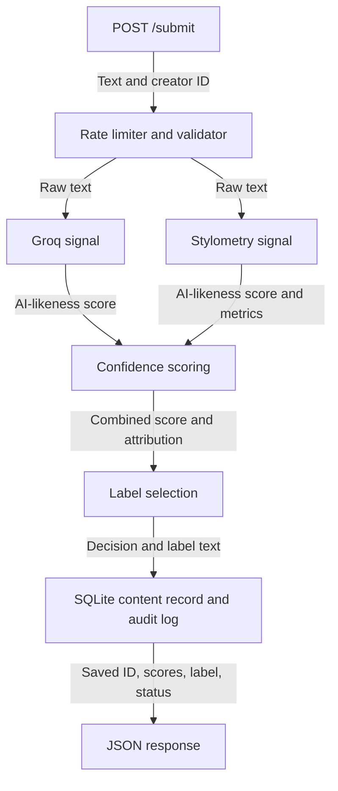
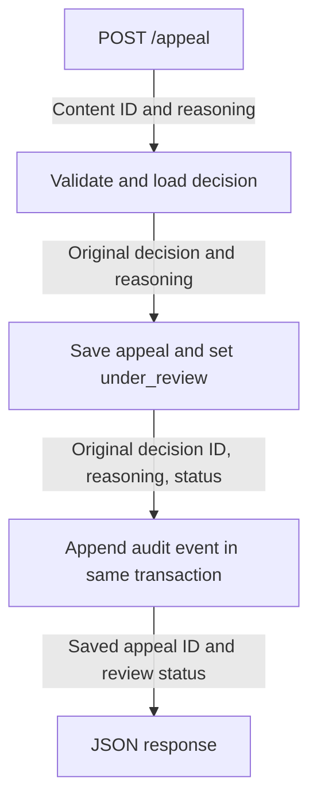
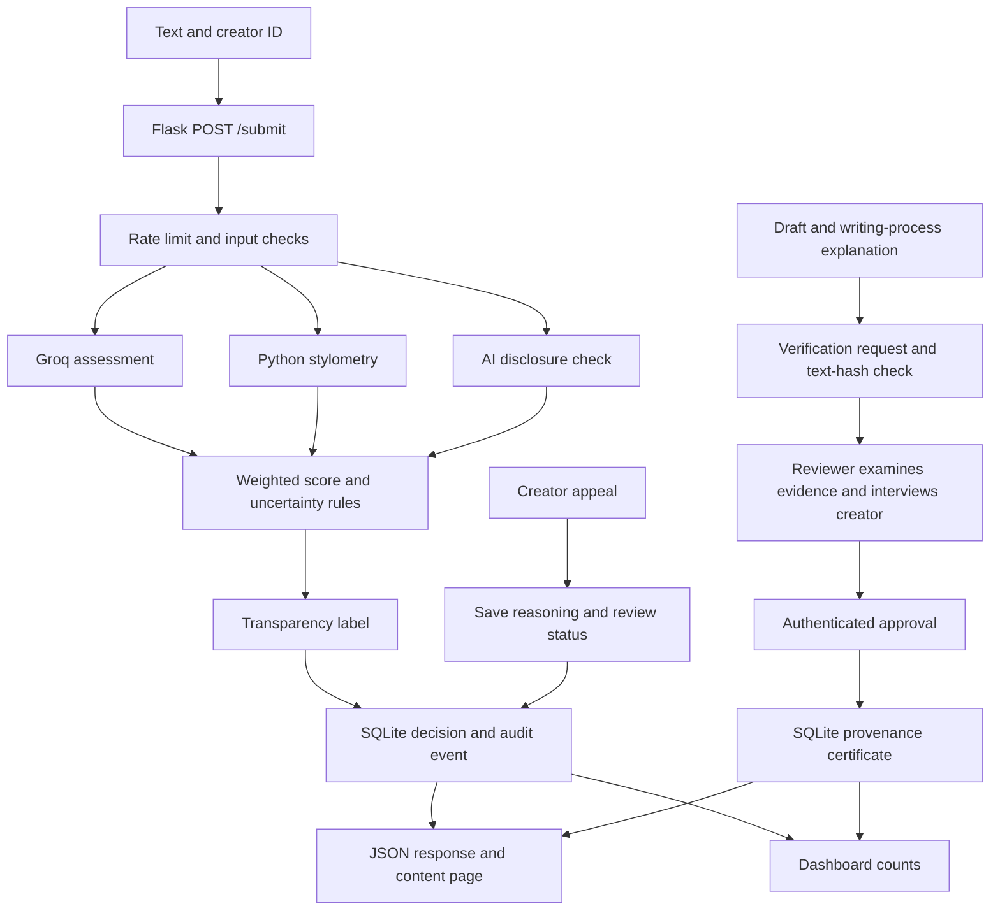

# Provenance Guard — Implementation Plan

## Project goal

I will build a Flask API that checks text for signs of AI generation. It will
return a confidence score and a label, and let a creator appeal the result.
The main goal is to explain uncertainty instead of treating a guess as proof.

I will use Flask for the API, Groq for one detection signal, Python text
measurements for the second signal, SQLite for storage, and Flask-Limiter for
request limits. The first version will focus on English text.

## Architecture

A submission will pass through rate limiting and validation before both signals
analyze the same text. Their scores will feed the confidence calculation and
label selection, then the decision and audit entry will be saved together.
An appeal will keep the original decision but add reasoning, update the review
status, and create a linked audit entry.





## Detection signals

Both signals will return `name`, `status`, `score`, `details`, and `error_code`.
A score will range from 0 (more human-like) to 1 (more AI-like). An unavailable
signal will have a null score rather than a made-up value.

| Signal                | What it measures and why I chose it                                                                                                   | What it can miss                                                                                                                  |
| --------------------- | ------------------------------------------------------------------------------------------------------------------------------------- | --------------------------------------------------------------------------------------------------------------------------------- |
| Groq model assessment | Overall phrasing, repeated sentence patterns, and consistency of voice. It can consider context that simple word counts cannot.       | Formal human writing may look generated, while edited AI writing may look human. It cannot see how the text was actually written. |
| Stylometry            | Sentence-length variation, vocabulary diversity, and punctuation density. These give repeatable measurements of the text's structure. | Poetry, short passages, and formal writing can break the assumptions. AI can also imitate uneven sentence lengths.                |

These are different approaches, but they can still make the same mistake.

### Groq signal

I will keep the API key in `.env` and make the model configurable with
`GROQ_MODEL`. The prompt will treat the submitted text as material to assess,
not instructions to follow. It will request JSON with `ai_score` and a short
`rationale` of at most 500 characters.

I will use temperature 0, a 300-token output limit, a 15-second timeout, and no
automatic retries. Invalid JSON, missing or extra fields, and scores outside
0–1 will make the signal unavailable. Timeouts and provider errors will also
produce an unavailable signal, while the second signal can still run.

### Stylometry signal

I will use Python's standard library to normalize Unicode, lowercase the text,
and replace curly apostrophes. Words will match `[a-z]+(?:'[a-z]+)*`; sentences
will split at periods, question marks, exclamation marks, and newlines. Empty
fragments will be ignored, and the last fragment will count without punctuation.

The measurements will be:

- `sentence_cv`: population standard deviation of sentence word counts divided
  by their mean. Lower values mean more uniform sentence lengths.
- `ttr`: unique words divided by total words in the first 100 word tokens.
  Lower values mean more repeated vocabulary.
- `punctuation_density`: Unicode punctuation characters divided by all
  characters, including spaces. This will be recorded but will not affect the
  score because punctuation alone does not have a clear AI direction.

The structural score will use these starting formulas:

```text
clamp(x) = min(1, max(0, x))
uniformity = 1 - clamp(sentence_cv / 0.75)
repetition = 1 - clamp((ttr - 0.35) / 0.45)
stylometry_score = 0.70 * uniformity + 0.30 * repetition
```

The details will include word count, sentence count, and all five measurements.
One sentence will have zero sentence variation. Text with no recognized words
will return an unavailable signal with `no_words` and null measurements.

## Confidence and uncertainty

I will combine the signals as follows:

```text
ai_score = 0.60 * groq_score + 0.40 * stylometry_score
confidence = max(ai_score, 1 - ai_score)
```

Groq will get slightly more weight because it considers context. These weights
are initial design choices, not measured accuracy rates.

| Combined AI score     | Attribution      |
| --------------------- | ---------------- |
| At least 0.90         | `likely_ai`    |
| At most 0.20          | `likely_human` |
| Between 0.20 and 0.90 | `uncertain`    |

The AI threshold will be stricter because wrongly accusing a human writer can
harm their reputation. I will override either directional result to uncertain
when there are fewer than 50 words or 3 sentences, or when the two signal scores
differ by more than 0.40. If either signal fails, both combined scores will be
null and the result will be uncertain.

The API will include reasons such as `signal_unavailable`, `insufficient_text`,
`signal_disagreement`, and `middle_range`. Rules will run in that order, before
choosing a directional label. Scores will not be rounded before comparison.

A confidence of 0.60 could come from an AI score of 0.60 or 0.40. Both are
uncertain; the number does not mean a proven 60% chance of correct authorship.
A score of 0.51 will stay uncertain, while 0.95 can receive the AI label if the
length and agreement checks pass.

## Transparency labels

The API will return these exact strings:

| Variant               | Label text                                                                                                                  |
| --------------------- | --------------------------------------------------------------------------------------------------------------------------- |
| High-confidence AI    | "This text shows strong signs of AI generation. This automated assessment can be wrong. Creators can appeal."               |
| High-confidence human | "This text shows strong signs of human writing. This automated assessment does not verify authorship. Creators can appeal." |
| Uncertain             | "We cannot confidently determine whether this text is human-written or AI-generated. Creators can appeal."                  |

An open appeal will add: "The creator has contested this assessment. It is under review."

## API and storage

| Endpoint                      | Input                                 | Successful response                                                                                             |
| ----------------------------- | ------------------------------------- | --------------------------------------------------------------------------------------------------------------- |
| `POST /submit`              | `text`, `creator_id`              | 200: content ID, attribution, both signals, AI score, confidence, label, uncertainty reasons, status, timestamp |
| `GET /content/<content_id>` | Content ID                            | 200: original decision, current status, appeal details, review notice                                           |
| `POST /appeal`              | `content_id`, `creator_reasoning` | 201: appeal ID, content ID,`under_review`, timestamp, confirmation                                            |
| `GET /log`                  | Optional`limit` and `offset`      | 200: audit events in event-ID order                                                                             |

Requests will be JSON objects with only the expected fields. Text must be
nonblank and no longer than 20,000 characters; creator IDs will allow 100
characters, and appeal reasoning 5,000. The body limit will be 128 KiB. Creator
IDs and reasoning will be trimmed, while submitted text will be preserved.
Content and appeal IDs will be UUIDs, and timestamps will use UTC.

Invalid requests will return 400, oversized bodies 413, non-JSON requests 415,
missing content 404, duplicate appeals 409, rate-limit failures 429, and storage
failures 503. Errors will use `{"error":{"code":"...","message":"..."}}`.
Log reads will default to 20 entries, allow up to 100, and start at offset 0.

SQLite will have `contents`, `appeals`, and `audit_events` tables. Every decision
event will include the content and creator IDs, timestamp, attribution, scores,
signal details, label, status, and policy version. Appeal events will also store
reasoning and a link to the original event. Raw text will be sent to Groq but
will not have a separate stored field.

## Appeals and edge cases

A creator will submit their content ID and explain why they disagree. The API
will save that reasoning, set the content to `under_review`, and append an audit
event in one transaction, so all changes succeed or fail together. The original
score and label will stay unchanged. A unique content-ID constraint will allow
only one appeal per submission.

A reviewer will be able to see the original decision, signals, explanation,
reasoning, and timestamps through the log and content lookup. The host platform
will need to provide the original text. This version will collect appeals but
will not assign reviewers or make final review decisions. It will also be a
local demo without authenticated ownership checks.

| Edge case                                                     | Planned handling                                                                           |
| ------------------------------------------------------------- | ------------------------------------------------------------------------------------------ |
| A human poem repeats short lines and simple words             | Use the length and disagreement checks; allow an appeal if a longer poem is still flagged. |
| Formal human writing looks AI-generated                       | Use the stricter AI threshold and a label that acknowledges possible mistakes.             |
| A short caption or emoji-only submission                      | Return uncertain; avoid calculating metrics with no words.                                 |
| Submitted text tries to instruct the model                    | Treat it as untrusted content and validate the provider response.                          |
| Groq times out or exceeds its quota                           | Record an unavailable signal and an uncertain decision.                                    |
| Missing content, blank appeal reasoning, or a repeated appeal | Return 404, 400, or 409 without changing the record.                                       |
| Two appeals arrive together or an audit write fails           | Prevent duplicates in the database and roll back incomplete writes.                        |

## Rate limiting and testing

I will limit submissions to **10 per minute and 100 per day per client IP**.
This should allow normal revisions while limiting bursts and daily model usage.
Flask-Limiter will run before detection, using fixed windows, `memory://`
storage, and `request.remote_addr`. Invalid submission attempts will count.
Other routes will stay available, and 429 responses will include `Retry-After`.
Memory-based counters will reset on restart and will not be shared by workers.

I will test a generated sample, an original human sample, formal human prose,
and a human-edited AI draft. Longer samples will have at least 50 words and
3 sentences; short inputs will be tested separately. I will repeat the first
four cases three times and use four additional examples to check the results.

Tests will cover the score boundaries, signal disagreement, provider failures,
all three labels, appeals, rollback, and preserved audit history. Rate-limit
tests will use a controlled detector to avoid spending provider quota: twelve
rapid requests should produce ten 200s and two 429s. A controlled clock will
check the daily limit. Live results and mocked tests will be reported separately.

## AI Tool Plan

| Milestone                      | Context I will provide                                        | What I will request                                                             | How I will check it                                                                                                          |
| ------------------------------ | ------------------------------------------------------------- | ------------------------------------------------------------------------------- | ---------------------------------------------------------------------------------------------------------------------------- |
| 3: submission and first signal | Architecture diagrams, signal contract, API, and storage plan | Flask app, standalone Groq function, submission endpoint, and initial audit log | Test the signal directly, then valid and invalid requests; confirm each successful submission has a matching log entry.      |
| 4: second signal and scoring   | Signal formulas, uncertainty rules, labels, and diagrams      | Stylometry function and combined scoring                                        | Hand-check metrics, test thresholds, compare different writing samples, and inspect disagreement.                            |
| 5: production features         | Labels, appeals, edge cases, rate limits, and diagrams        | Label mapping, appeal and lookup endpoints, rate limiting, and complete logging | Match exact labels, check status changes and linked events, test duplicate appeals and rollback, and verify quota responses. |

## Stretch: ensemble detection

I will add a third signal for explicit AI-origin disclosures, such as “as an AI
language model.” It will score 1 when a disclosure appears and 0.5 when none
appears; missing disclosure will not count as evidence of human authorship.
The ensemble will use 55% Groq, 35% stylometry, and 10% disclosure evidence.
I will keep the length and score thresholds above. A difference above 0.40
between informative signals will force uncertainty; a neutral disclosure score
will not trigger disagreement. Responses will include all scores and weights.
The original two-signal policy will remain available for historical tests.

## Stretch: provenance certificate

I will let a creator request verification by supplying the submitted text, an
earlier draft, and an explanation of their writing process. A reviewer will
check those materials and confirm the creator's identity and authorship in a
live conversation before approving. A secret reviewer token will protect the
review endpoints; evidence will only be readable through those endpoints.
The app will store a SHA-256 digest of submitted text to bind the request and
certificate to that exact submission. Older submissions without a digest will
need to be resubmitted. An approved request will create one permanent,
content-specific certificate, with its ID, creator, reviewer, and issue time.
The content page will show a separate “Verified human” badge while preserving
the detection label. This credential will represent a reviewer's attestation,
not proof from the detector. I will test unauthorized review, hash mismatch,
rejection, duplicate approval, persistence, and unchanged audit decisions.

## Stretch: analytics dashboard

I will add a browser view at `/dashboard` and matching JSON at `/analytics`.
It will show the count and share of each detection verdict, the percentage of
submissions appealed, and the percentage with a provenance certificate. Each
submission will count once, even if it has multiple audit events. Empty storage
will show zero counts and an explanation. A policy-version breakdown will make
older and newer decisions distinguishable. The latest 20 submissions will link
to content pages with individual signal scores, weights, the transparency label,
and any separate certificate badge. Private verification evidence will stay off
these pages. I will test empty data, mixed decisions, appeals, certificates,
HTML escaping, and the dashboard's totals.

## Mermaid Diagram After Stretch Features

